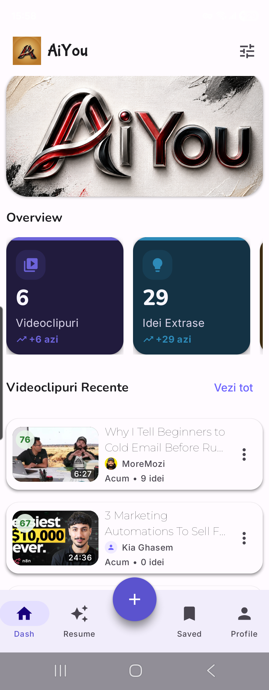
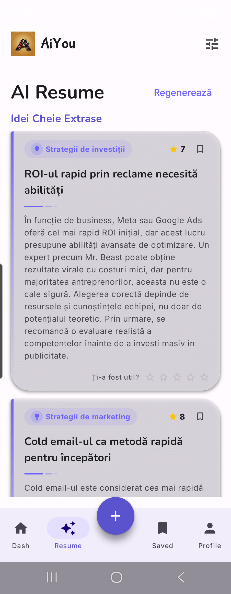
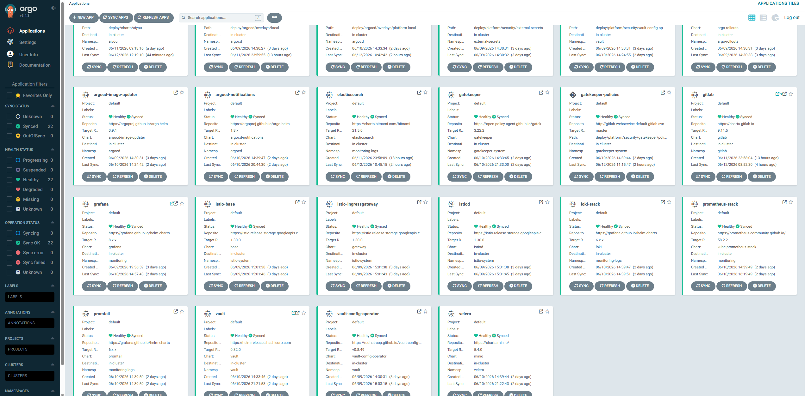

# AiYou

### Turn any video into a set of actionable ideas and strategies

An Android app that automatically extracts the key ideas from videos (YouTube),
organizes them by category and generates an **AI Resume** of the essential strategies —
so you learn faster without watching everything end to end.

---

## 📲 Installation

1. Download **[`AiYou.apk`](../../releases/latest/download/AiYou.apk)** (the link starts the download right away — or grab it [from the repo](AiYou.apk)).
2. On your phone, open the downloaded file.
3. If a warning appears, allow installation from *unknown sources* for the app you opened the APK with (browser / file manager).
4. Tap **Install** and open **AiYou**.

> Requires Android 6.0 (API 26) or newer. Debug APK, developer-signed — for internal distribution / demo.

---

## ✨ What the app does

| Feature | Description |
|---|---|
| 🎬 **Idea extraction** | Analyzes videos and automatically pulls out the key ideas, with a relevance score. |
| 🧠 **AI Resume** | Generates a summary of the strategies (investing, marketing, etc.) from the processed content. |
| 🏷️ **Categories** | Ideas are grouped by topic: *Investing strategies*, *Marketing strategies*, and so on. |
| 🔖 **Saved** | Bookmark and keep the important ideas for later. |
| 📊 **Dashboard** | Live stats: processed videos, extracted ideas, time saved. |
| ⭐ **Feedback** | Rate the usefulness of each idea to improve the results. |

---

## 📸 Screenshots

<table>
  <tr>
    <td align="center" width="50%">
       
      <b>AI Resume</b> 
      Key ideas extracted, by category, with rating
    </td>
    <td align="center" width="50%">
       
      <b>Dashboard</b> 
      Overview with stats and recent videos
    </td>
  </tr>
</table>

 

 
<b>Tablet view</b> — adaptive layout with side navigation

---

## ☸️ Infrastructure & Deployment

The AiYou backend runs on **Kubernetes**, delivered **GitOps**-style via **Argo CD** —
every component (API, Elasticsearch, Istio, observability, security) is an application
synced automatically from Git, with *Healthy / Synced* status.

 
Argo CD — platform applications (AiYou API, Elasticsearch, Istio, Gatekeeper, Vault, Grafana/Loki/Prometheus, Velero) synced via GitOps

---

## 🛠️ Tech stack

- **Kotlin** + **Jetpack Compose** (declarative UI)
- Clean **multi-module** architecture (`core` / `feature`)
- **MVVM**, Coroutines & Flow
- **Adaptive** layout for phone and tablet

| | |
|---|---|
| Package | `com.podut.aiyou` |
| minSdk | 26 (Android 6.0) |
| targetSdk / compileSdk | 35 (Android 15) |
| Version | 1.0 |

---

© AiYou — built by <a href="https://github.com/podut">podut</a>

